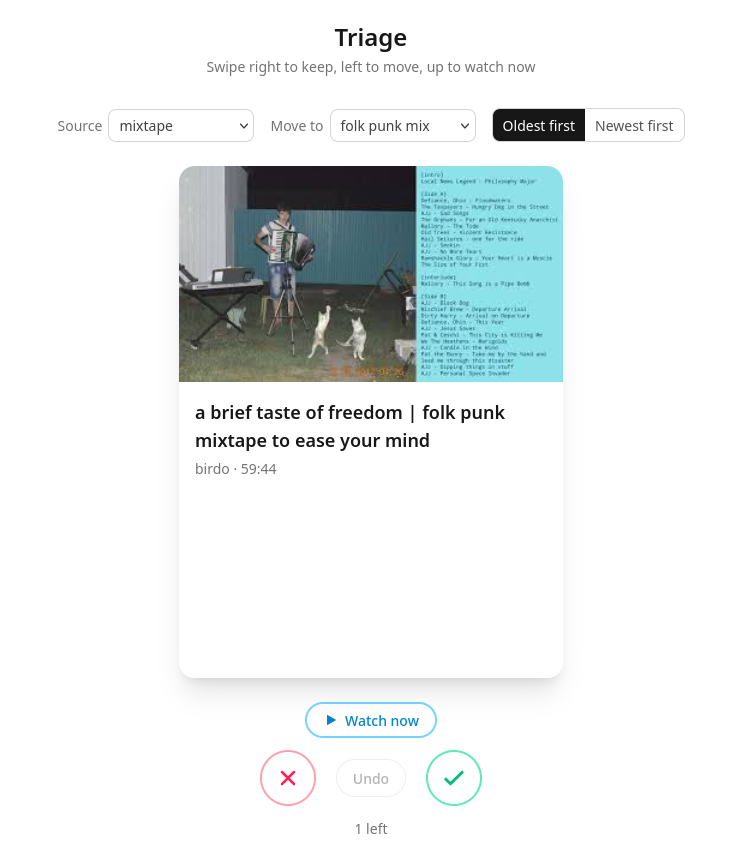

# youtube-swipe

**Disclaimer: I am using this project as an excuse to grow my familiarity with AI tooling and will thus heavilly use Claude and Copilot**

This repo is mostly here as a worked example of me directing AI tooling — Claude
Code for the implementation, GitHub Copilot for review — on something with real
moving parts rather than a toy: Google OAuth, a crash-safe background job queue,
YouTube API quota budgeting, and a reactive SPA. I own the architecture, the code
review, and the milestone planning; the AI writes most of the code.



## What it does

A Tinder-style swipe UI for trimming down a bloated YouTube playlist (Watch
Later, a "listen later" mix, whatever).

- **Swipe right** — keep the video where it is.
- **Swipe left** — move it into a "reject" playlist. This is a real YouTube
  write: a background worker reconciles each move (insert into the target, then
  delete from the source, re-checking membership at every step) so a crash
  mid-move can only ever duplicate a video, never drop one.
- **Swipe up** — open the video now in a new tab; decide on it later.
- **Undo** any swipe; a reverted move is un-reconciled the same way.

Pick the source playlist, the move destination, and the deck order right in the
UI (the controls in the screenshot). The playlist is synced into local SQLite and
cards are served from there, so triaging costs no API quota — only the moves do,
and the worker stops before it reaches the daily 10k-unit ceiling and resumes the
next day. The backend owns OAuth end to end (the SPA never sees a token) and
notices when a grant has expired or been revoked, showing a "reconnect" screen
instead of failing silently.

More detail: [docs/design.md](docs/design.md) (product spec, API contract) and
[docs/implementation-plan.md](docs/implementation-plan.md) (stack, infra, milestones).

## Known shortcut: single-user

This runs as one person, one Google account, one SQLite file — no sessions, no
per-user data, no auth beyond "can you reach the server." That's deliberate.
Going multi-user means signed session cookies, one token row per user, `user_id`
on every table, and per-user quota sub-budgets under the shared 10k/day; it's
scoped out as future work in
[docs/implementation-plan.md](docs/implementation-plan.md). The point here was the
build, not running a service.

## Development

Two independent packages: `web/` (SolidJS SPA) and `api/` (Fastify backend).
Requires Node 22+.

### Frontend (`web/`)

```bash
cd web
npm install
npm run dev        # dev server; proxies /api/* to the backend on :8080
npm test           # Vitest, once
npm run typecheck  # tsc, no emit
npm run lint        # eslint
npm run format      # prettier --write
npm run build       # static build to web/dist
```

### Backend (`api/`)

```bash
cd api
npm install
cp .env.example .env   # then fill in Google OAuth creds + YOUTUBE_PLAYLIST_ID
npm run dev            # dev server on :8080
```

One-time: with the backend running, open <http://localhost:8080/api/auth/login>
once to authorize with Google. See [api/README.md](api/README.md) for the Google
Cloud setup and the full endpoint list.

Run both together in dev; in production Fastify serves the built `web/dist`
same-origin.
